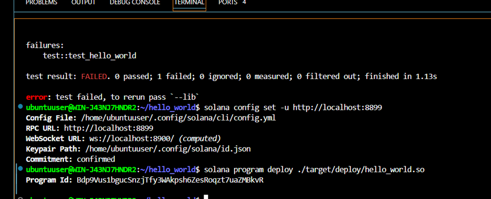
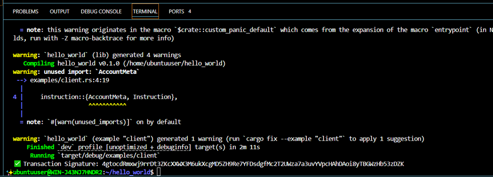

## 🔐 Deployment Info

- **Deployed Program ID**:  
  `Bdp9Vus1bgucSnzjTfy3WAkpsh6ZesRoqzt7uaZMBkvR`

- **Wallet Address (payer)**:   
  `AzpCH3h11u2ZtuRrJhNqghSTmcB2iUPShdtsKrYi5StF` 
 ## 🖼️ Program Output
- **Deployed Program ID**: 




 ## 🖼️ Program Output
- **Deployed Program Signature**: 


---


```markdown
# 🚀 Solana Hello World Program

This is a minimal Solana smart contract (program) written in Rust that prints a log message when invoked.

## 📦 Structure

- `src/lib.rs`: program logic (prints `Hello, Solana!`)
- `examples/client.rs`: Rust client to call the program
- `target/deploy/hello_world.so`: compiled program
- `hello_world-keypair.json`: program ID keypair

## 🧪 Local Testing

```bash
solana-test-validator
solana program deploy ./target/deploy/hello_world.so
cargo run --example client
🔐 Deployment Info
Deployed Program ID:
Bdp9Vus1bgucSnzjTfy3WAkpsh6ZesRoqzt7uaZMBkvR

Wallet Address:
`AzpCH3h11u2ZtuRrJhNqghSTmcB2iUPShdtsKrYi5StF`

🛠️ Tech Stack
Rust + Cargo

Solana SDK (solana-program, solana-client)

cargo build-sbf, solana-cli

